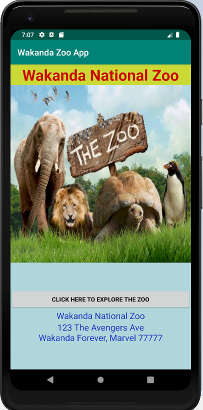
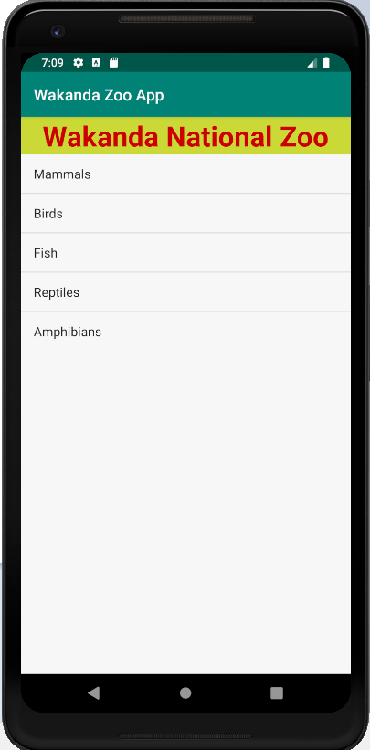
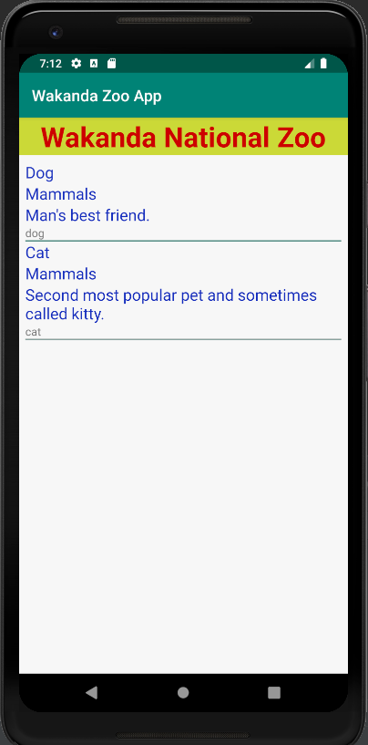
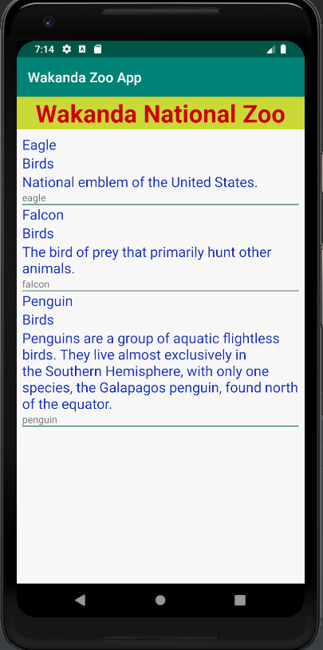
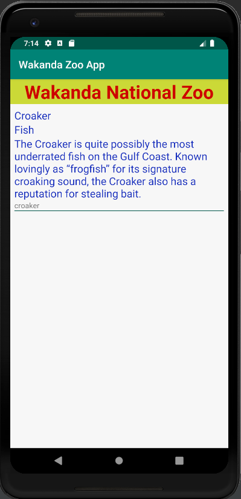
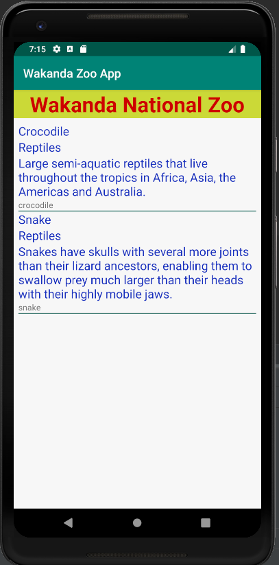
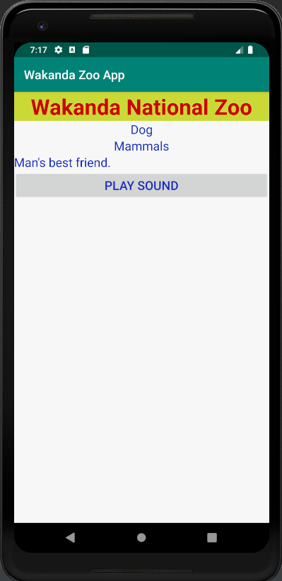
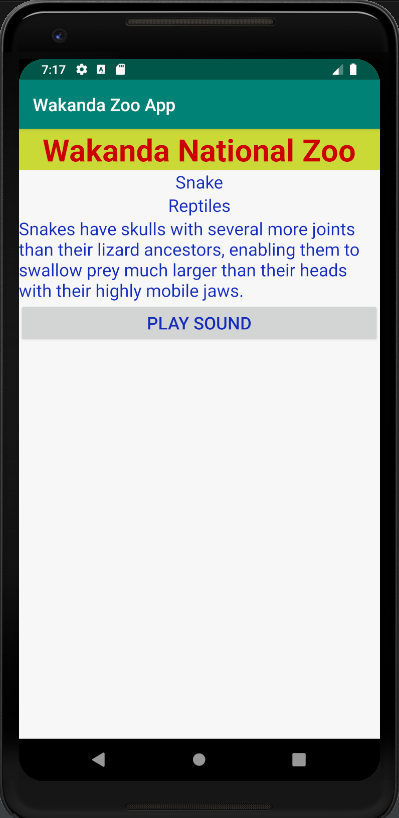

# Week2Daily4Homework
Homework Research and Zoo Database App

Homework Week Two Day Four

Research word file: Week2Day4Research.docx

Coding Project: Wakanda National Zoo App with new database helper classes called ZooDatabaseHelper and ZooDatabaseContract
Coding
1. Complete Room Codelab:  https://codelabs.developers.google.com/codelabs/android-room-with-a-view/#0
2. Finish refactoring last nights homework to use a SQLite database

UPDATE: ZooDatabaseHelper and ZooDatabaseContract have successfully been implemented and connected into the Zoo App.

Instructions:

- Run the Android project
- Create a new Virtual Device if not already. Then, choose Pixel 2 XL, then click OK.
- Click on the "Click Here to Explore the Zoo" button.
- It will then display the categories of animal using the ListView.
- When you click on each of the category, it will then display the list of animals in that category using the RecyclerView.
- In the next activity, click on each of the animal item itself, it will then bring up the animal page.
- In each animal page, click on the "Play Sound" button to listen to the animal's sound.

